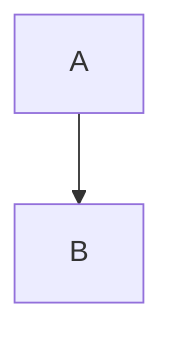

# Markdown Publisher (React + Vite)

This repo is a tiny publishing system for sharing field notes and articles directly from markdown files. Posts live alongside the code, get rendered with React, and deploy automatically to GitHub Pages on every push to `main`.

## Stack

- [Vite](https://vitejs.dev/) + React 19 + TypeScript
- [`react-markdown`](https://github.com/remarkjs/react-markdown) + [`remark-gfm`](https://github.com/remarkjs/remark-gfm) for GitHub-flavoured markdown
- [`react-router-dom`](https://reactrouter.com/) for clean `/slug` permalinks per article
- GitHub Actions + GitHub Pages for hosting

## Prerequisites

- Node.js 20+
- npm 10+ (ships with Node 20)

## Getting started

```bash
npm install          # install dependencies
npm run dev          # start Vite dev server (default http://localhost:5173)
npm run build        # type-check + build the static site into dist/
npm run preview      # preview the production build locally
```

## Writing posts

1. Add a markdown file under the year folder inside `src/blog/` (e.g. `src/blog/25/my-post.md`). Keep formatting simple; GFM extensions (tables, strikethrough, lists) are supported.
2. Register the post in `src/content/posts.ts` by importing it with the `?raw` suffix and adding metadata (`slug`, `title`, `description`, optional `publishedAt`). The `slug` becomes the shareable route, e.g. `/25/esp-mosq`.
3. Place images in `public/images/` (or any folder inside `public/`) and reference them from your markdown using absolute paths such as ``.
4. Run `npm run dev` to preview your changes live.

The homepage automatically lists every post defined in `src/content/posts.ts` and renders the markdown via `react-markdown`.

## Mermaid diagrams

Mermaid fenced code blocks render automatically:

````

````

## Deployment

GitHub Actions workflow (`.github/workflows/deploy.yml`) builds and publishes the site whenever commits land on `main`.

Workflow summary:

1. Checkout code, install dependencies with `npm ci`, and run `npm run build`.
2. Upload the `dist/` folder as a Pages artifact.
3. Deploy to GitHub Pages using `actions/deploy-pages`.

No manual steps are required—push to `main` and Pages will update.

## Project layout

```
.
├── public/                 # static assets copied as-is
├── src/
│   ├── App.tsx             # main UI (sidebar + markdown renderer)
│   ├── App.css / index.css # styling
│   ├── blog/
│   │   └── 25/             # markdown sources grouped by year (esp-mosq.md, ...)
│   └── content/posts.ts    # metadata + content registry
├── .github/workflows/      # deployment pipeline
├── package.json            # scripts + deps
└── vite.config.ts          # Vite + GitHub Pages base config
```

## Development guidelines

- Keep markdown human-readable—avoid excessive HTML; prefer headings, lists, images.
- Always import markdown using the `?raw` suffix so Vite treats it as plain text (see `src/content/posts.ts`).
- If you add code blocks inside markdown, include the language hint for syntax highlighting later.
- Run `npm run build` before pushing to catch TypeScript or lint failures.
- Keep dependencies lightweight; this site is meant to stay fast and simple.
