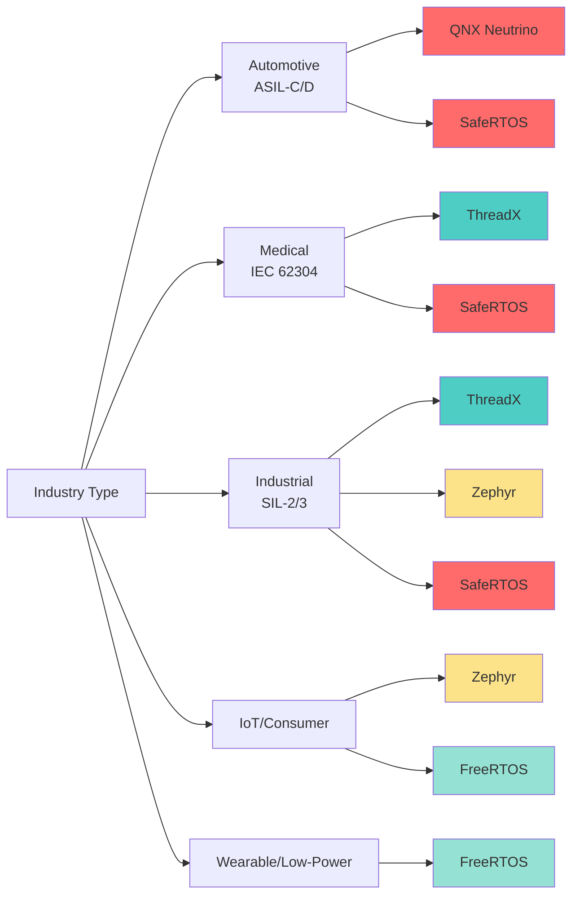
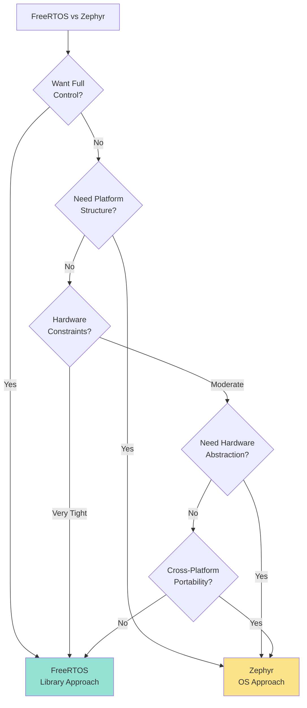

# RTOS Selection Guide 2026

## Key Selection Aspects

**Security & Safety**: Built-in security features (secure boot, memory protection, device attestation), functional safety certifications (IEC 61508, ISO 26262, EN 50128), and safety integrity levels (SIL-2/3, ASIL-B/D).

**MISRA Alignment**: Code compliance with MISRA-C standards, availability of static analysis reports, and integration with CI/CD pipelines.

**Ecosystem & Tooling**: Hardware abstraction layers, networking stacks, OTA update support, vendor BSP quality, and long-term maintenance guarantees.

**Complexity & Scalability**: Learning curve, build system complexity, portability across hardware, and support for multi-core systems.

**Resource Requirements**: Flash/RAM footprint, real-time determinism, interrupt latency, and power management capabilities.

**Certification Readiness**: Pre-certified artifacts, safety documentation, patch cadence, CVE handling, and vendor support windows.

## Decision Flowcharts

### Primary Selection Flow

```mermaid
flowchart TD
    Start[Need RTOS?] --> Simple{Simple<br/>Single Purpose?}
    Simple -->|Yes| BareMetal[Consider Bare Metal]
    Simple -->|No| Safety{Safety<br/>Critical?}
    
    Safety -->|Yes| CertLevel{Required<br/>Certification?}
    CertLevel -->|SIL-3/ASIL-D| SafeRTOS[SafeRTOS or QNX]
    CertLevel -->|SIL-2/ASIL-B| ThreadX[ThreadX or Zephyr Safety]
    CertLevel -->|Medical/IEC 62304| ThreadX
    
    Safety -->|No| Security{High Security<br/>Requirements?}
    Security -->|Yes| ZephyrSec[Zephyr or ThreadX]
    Security -->|No| Complexity{System<br/>Complexity?}
    
    Complexity -->|Low/Medium| FreeRTOS[FreeRTOS]
    Complexity -->|High/Multi-subsystem| Zephyr[Zephyr]
    
    style SafeRTOS fill:#224411
    style ThreadX fill:#224411
    style FreeRTOS fill:#224411
    style Zephyr fill:#442211
    style ZephyrSec fill:#442244
```

### Industry-Specific Selection

### FreeRTOS vs Zephyr Decision

## Quick Reference Table

| RTOS | Best For | Safety Cert | Security | Complexity | Footprint |
|------|----------|-------------|----------|------------|-----------|
| **FreeRTOS** | Low-power, simple devices, rapid prototyping | Third-party certs | AWS extensions | Low | Minimal |
| **Zephyr** | IoT, industrial, cross-platform, complex systems | Evolving safety | Built-in framework | Medium-High | Moderate |
| **ThreadX** | Medical, consumer, industrial controllers | Proven certs | Strong integration | Medium | Moderate |
| **QNX** | Automotive, rail, high-assurance systems | ASIL-C/D, SIL-3 | Microkernel isolation | High | Larger |
| **SafeRTOS** | Safety-critical microcontrollers, robotics | SIL-3, ASIL-D | Security-first | Medium | Moderate |

## Selection Checklist

- [ ] Identify safety class (ASIL-B/D, SIL-2/3, medical, or unregulated)
- [ ] Evaluate pre-certified artifacts and documentation
- [ ] Check security features (kernel + BSP level)
- [ ] Assess MISRA alignment and static analysis reports
- [ ] Map ecosystem maturity (networking, OTA, memory protection)
- [ ] Validate long-term maintainability (patches, CVE handling, support)
- [ ] Consider resource constraints (flash/RAM)
- [ ] Evaluate learning curve and team expertise
- [ ] Assess portability requirements
- [ ] Review vendor support and lifecycle policies

